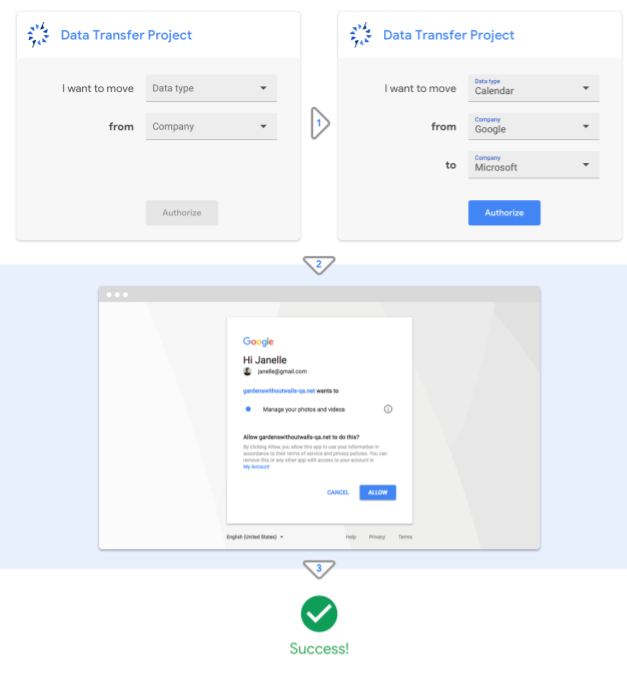

## **Who We Are**
Data Transfer Project (DTP) is a collaboration of industry partners committed to building a common framework with open-source code that can connect any two online service providers, enabling a seamless, direct transfer of data between the two platforms.

We want all individuals across the web to be in control of their data.

## **How It Works**

An individual who wants to move their photos data from Serivce Provider C, for example, to Service Provider E, doesn’t have to worry about file types since both Service Provider C and Service Provider E are part of the Data Transfer Project.  Data Transfer Project APIs handle the file conversions on both ends, as well as manage the transaction between services.  Each Service Provider uses their own primary authentication infrastructure to ensure authentication on both sides of the transfer.

### Initial Data Portability Enabled
The initial set of file types which can be moved directly between online service providers via Data Transfer Project include:   

+  calendar
+  contacts
+  email
+  photos
+  posts  

The Data Transfer Project is actively working to extend the supported set of data format types, and we are looking for partners to help us in this area. Additional file types for service-to-service transfer that the DTP intends to support include documents, spreadsheets, videos, sensor data, CAD files and more   

We hope to eventually include all file types across all services.

### Initial Set of Integration  
Data Transfer Project APIs have been built for the following service providers and file types:

+  Google: Photos, calendar, mail, contacts, tasks
+  Microsoft: Calendar, contacts
+  Flickr: Photos
+  Instagram: Photos
+  Rememberthemilk: Tasks

### Demo User Interface (UI)
The Data Transfer Project has developed minimal UI for testing, validation, and demo purposes, which is not intended to be used in production. DTP functionality is expected be incorporated into the service providers UI, which will create a more embedded experience for individuals.

## **How To Participate**
There are many ways to participate in this open source project:

### Become a Provider by Integrating a Service  
If you just want to enable your service to share files using the Data Transfer Project toolset, check out the [Provider Integration Guide](https://github.com/google/data-transfer-project/blob/master/Documentation/Integration.md) on Github and download the code. 

Providers who incorporates this code into their current platform give individuals the ability to transfer their data to or from their service. For example, with this tool fully implemented, anyone could seamlessly transfer their photos from one photos service provider to another.

### Contribute To The Core Framework  
If you would like to write an API to a new data type and/or extend the DTP framework see [Developer Guide](https://github.com/google/data-transfer-project/blob/master/Documentation/Developer.md) on the [Data Transfer Project Github site](https://github.com/google/data-transfer-project).

### Hosting Options For a DTP Instance  
Partners may host an instance of Data Transfer Project configured to their needs on any docker-based platform.  Google Cloud Platform and Microsoft Azure already have pre-built tools for hosting Data Transfer Project. 

### **Contact Us**  
+  General questions and discussion: portability-discuss@googlegroups.com
+  Slack channel, email portability-maintainers@googlegroups.com for invitation
+  Weekly Skype call, email portability-maintainers@googlegroups.com for invitation 

## **About Us**

The Data Transfer Project was formed in 2017 to create an open-source, service-to-service portability platform so that all individuals across the web could easily move their data between online service providers.

The partners in the Data Transfer Project believe portability and interoperability are central to innovation. Making it easier for individuals to choose among services facilitates competition, empowers individuals to try new services and enables them to choose the offering that best suits their needs. 

We anticipate the Data Transfer Project solution will make a particularly big impact in global markets where downloading or uploading data is expensive and/or slow. The Data Transfer Project eliminates the need to download data at all. Instead, files are transferred directly between service providers.

## **Founding Partners**
  
