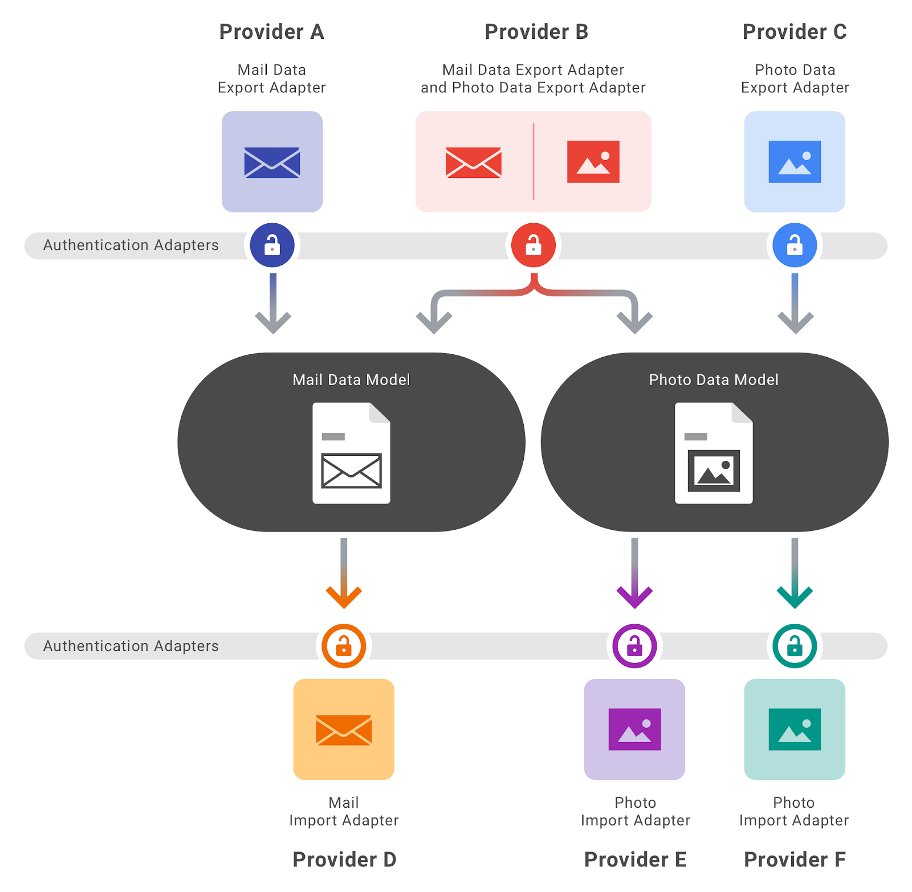

**ADD LOGO  Data Transfer Project**  

## **Who We Are**
Data Transfer Project is a collaboration of industry partners committed to building a common framework with open-source code that can connect any two online service providers, enabling a seamless, direct transfer of data between the two platforms.

We want all individuals across the web to feel in control of their data.

## **How it works**

An individual who wants to move their photos data from Service C, for example, to Service 2, doesn’t have to worry about file types since both Service C and Service 2 are part of the Data Transfer Project.  Data Transfer Project APIs handle the file conversions on both ends, as well as manage the transaction between services.  The Service Providers authenticate on both ends using their primary authentication infrastructure.

### Initial Data portability enabled
The initial set of file types supported by the DTP ecosystem which can be moved directly between service providers include:  

+  calendar
+  contacts
+  email
+  photos
+  posts  

The Data Transfer Project is actively working to extend the supported set of data format types, and we are looking for partners to help us in this area. Additional file types for service-to-service transfer the DTP will support include documents, spreadsheets, videos, sensor data, .dwg and more.   

We hope to eventually include all file types across all services.

### Initial set of Integration  
Data Transfer Project APIs have been built for the following service providers and file types:

+  Google
    +  Photos, calendar, mail, contacts, tasks

+  Microsoft
    +  Calendar, contacts

+  Flickr
    +  Photos

+  Instagram
    +  Photos

+  Rememberthemilk
    +  Tasks

## **How to Participate**
There are many ways to participate in this open source project:

### Integrate a service  
If you just want to enable your service to share files using the Data Transfer Project toolset, check out the Integration Guide on  Github and download the code 

Providers who incorporates this code into their current platform give individuals the ability to transfer their data to or from the provider. For example, with this tool fully implemented, anyone could seamlessly transfer their photos from one photos service provider to another.

### Hosting options for a Data Transfer Project Service  
Partners may host an instance of Data Transfer Project configured to their needs on any docker-based platform.  Google Cloud Platform and Microsoft Azure already have pre-built tools for hosting Data Transfer Project.

### Contribute to the platform  
If you would like to write an API to a new data type and/or extend the DTP framework see Developer Documentation on the Data Transfer Project Github site.

## **Docs & Reference**

+  [Data Transfer Project Whitepaper](Temp_Whitepaper.pdf)
+  ADD ABSTRACT when written
+  Walk-through Video/Screencast

## **About Us**

The Data Transfer Project was formed in 2017 to create an open-source service-to-service portability platform so that all individuals across the web could easily move their data between online service providers.

The partners in the Data Transfer Project believe portability and interoperability are central to innovation. Making it easier for individuals to choose among services facilitates competition, empowers them to try new services and enables individuals to choose the offering that best suits their needs. 

We anticipate the Data Transfer Project solution will make a particularly big impact in global markets where downloading or uploading data is expensive and/or slow. The Data Transfer Project eliminates the need to download data at all. Instead, files are transferred directly between service providers.

---
